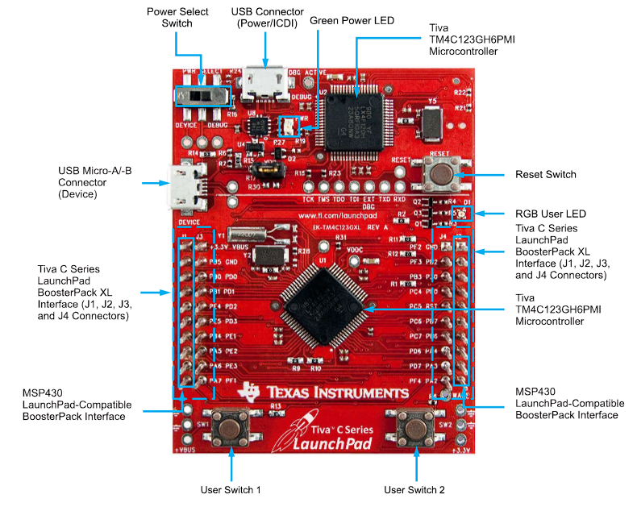

# microprocessor-systems
Basic Input/Output functions on a TivaC TM4C123G microprocessor programmed in ARM assembly language.

Configured the board to take analog inputs from a potentiometer and output digital outputs to LEDs.

  
   

